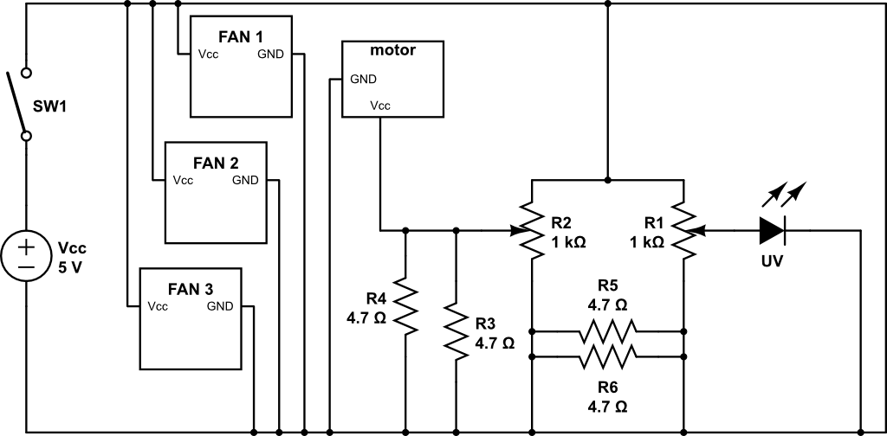

# :sparkles: BFFFS :sparkles: 

Hey! We are *NCSU E101 012 FEDD Group 1*: :sparkles: BFFFS! :sparkles:

We are:

- Jack Lynch
- Emerina Kelly
- Anam Navied
- Aaron Beaver
- Blake Goodman

This is our repository, where we keep the sketch that runs our project as well as all of our STL files.

Our machine can be operated two ways: *digitally* (with an Arduino) or *in analog* (with potentiometers). Both share a 5V rechargeable power source. The three-fan stack responsible for bubble-blowing airflow is linked independently to the 5V supply and is thus beyond user control, beyond switching power on/off. Switching operation methods requires reconfiguring the circuitry a bit (we left the Arduino control circuits on the breadboard so it's just a matter of re-plugging a few jumpers).

## Digital Operation

Digital operation involves an Arduino Uno taking input from a pushbutton (with a pulldown resistor) and driving the wheel motor with a [2N2222](http://a.co/e2eoqSZ) NPN transistor (for handling the current draw) and a zener diode (for guarding against momentary voltage reversals).

The initializations are relatively simple:

```C
 const int motorPin = 3;
 const int pullup = 2;
 const int LED = 13;
 const int UVleds = 4;
```

```C
  pinMode(motorPin, OUTPUT);
  pinMode(pullup, INPUT_PULLUP);
  pinMode(LED, OUTPUT);
  pinMode(UVleds, OUTPUT);
```

and most of the circuit control happens within a single if-else block:

```C
  int buttonVal = digitalRead(2);

  if (buttonVal == HIGH) {
    digitalWrite(LED, LOW);
    digitalWrite(UVleds, LOW);
    analogWrite(motorPin, 0);
  } else {
    digitalWrite(LED, HIGH);
    digitalWrite(UVleds, HIGH);
    analogWrite(motorPin, 255);
  }

```

## Analog Operation

The circuit illustrating potentiometer control of the UV LED and the bubble wheel is shown below.



One potentiometer controls LED intensity, and the other controls wheel speed.

## List of Materials

Forthcoming! So that our project may be reproduced.
